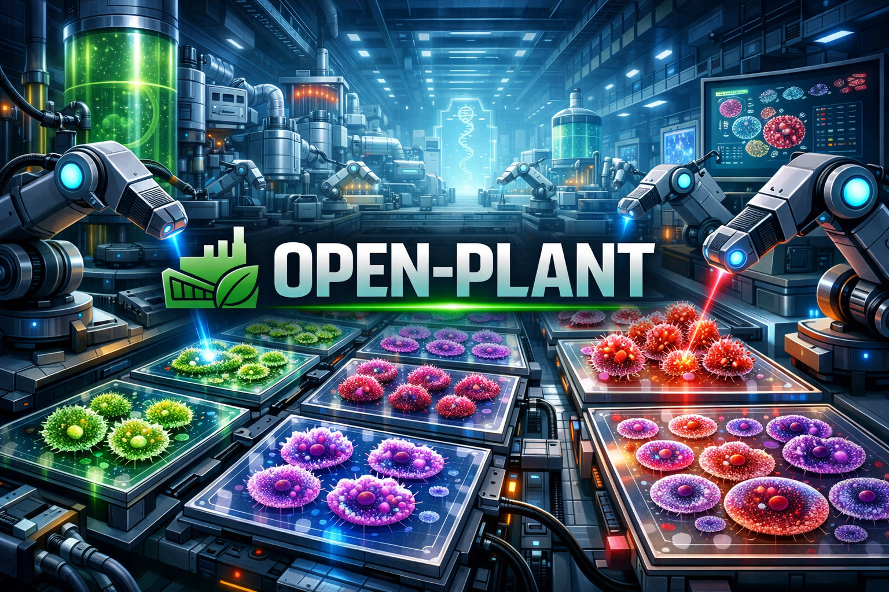

<p align="center">
  
</p>

<p align="center">
  WebGL2 기반 고성능 WSI(Whole Slide Image) 뷰어 라이브러리<br/>
  고사양 PC가 아니어도, 고작, 고~오작 iPhone 15에서 수백만 cell을 부드럽게 렌더링
</p>

<p align="center">
  <a href="https://frorong.github.io/open-plant/">📖 Documentation</a>&nbsp;&nbsp;·&nbsp;&nbsp;
  <a href="https://frorong.github.io/open-plant/ko/migration-guide.html">Migration Guide</a>&nbsp;&nbsp;·&nbsp;&nbsp;
  <a href="https://frorong.github.io/open-plant/ko/contributing.html">Contributing</a>&nbsp;&nbsp;·&nbsp;&nbsp;
  <a href="https://github.com/frorong/open-plant">GitHub</a>
</p>

> Engine roadmap: [`engine-roadmap.md`](./engine-roadmap.md)

---

<h3 align="center">10,000,000 cells · ~300 MB RAM · 60 fps · iPhone 15 ready</h3>

https://github.com/user-attachments/assets/5a6b5deb-7442-4389-908f-bf2c69348824

> 핵심 포지셔닝: Open Plant는 데스크톱 전용 엔진이 아닙니다. iPhone 15급 모바일 환경에서도 수백만 cell pan/zoom 워크로드를 체감 렉 없이 다루는 것을 목표로 설계했습니다.

## Why Open Plant

범용 시각화 프레임워크 위에 병리 뷰어를 올리면 추상화 비용을 그대로 떠안게 됩니다.
Open Plant는 WSI 렌더링 **한 가지만** 하도록 설계되었고, 그래서 아래가 가능합니다.

### 모바일 실전 성능 (iPhone 15)

Open Plant는 “고사양 PC에서만 빠른 뷰어”가 아니라, iPhone 15 같은 일반 플래그십 모바일에서도
수백만 cell을 pan/zoom하면서 작업 가능한 성능을 목표로 최적화되어 있습니다.
타일 스케줄러 + fallback 렌더링 + TypedArray 포인트 파이프라인 덕분에, 실제 사용 시에도 뷰 전환 안정성을 유지합니다.
(`실효 성능은 데이터 밀도/타일 서버 응답/네트워크 상태에 따라 달라질 수 있습니다.`)

### 포인트 1개당 10바이트

범용 라이브러리는 포인트마다 인스턴스 버퍼에 position + RGBA를 넣어 **20바이트 이상** 씁니다.
Open Plant는 `Float32Array`(x, y) 8바이트 + `Uint16Array`(palette index) 2바이트 = **10바이트**입니다.
색상은 1×N 팔레트 텍스처 1장에 들어가므로, term 색상을 바꿀 때 수백 바이트짜리 텍스처만 재업로드하면 됩니다.
50만 셀 기준 GPU 메모리가 **절반 이하**로 줄어듭니다.

### 프래그먼트 셰이더 안에서 끝나는 링 렌더링

`gl.POINTS` + `gl_PointCoord`로 원형 마스킹하고, ring width를 `clamp(3.0 / pointSize, 0.12, 0.62)`로 줌에 따라 적응시킵니다.
안티앨리어싱도 `smoothstep(1.5 / pointSize)` 기반으로 프래그먼트 셰이더 안에서 처리하기 때문에 하드웨어 MSAA를 끌 수 있습니다.
고배율에서는 얇은 링으로 개별 세포를 구분하고, 저배율에서는 두꺼운 링으로 밀집 영역이 묻히지 않습니다.
별도 geometry 없이 draw call **1회**로 전체 포인트를 그립니다.

### 2-pass fallback 타일 렌더링

일반적인 타일 뷰어는 줌 전환 시 현재 tier 타일만 그리고, 로딩 중인 칸은 부모 타일을 확대하거나 회색 placeholder를 보여줍니다.
Open Plant는 매 프레임 **캐시 전체**(최대 320장)를 viewport와 교차 검사해서, tier 오름차순(가장 거친 것부터)으로 먼저 깔고 그 위에 현재 tier를 덮어씁니다.
줌/팬 중 **빈 타일이 보이지 않습니다.**

### 타일과 포인트가 같은 렌더 루프

별도 레이어 시스템 없이 하나의 WebGL2 컨텍스트에서 `fallback tiles → current tiles → points` 순서로 draw call이 나갑니다.
카메라가 바뀌면 한 프레임 안에 타일과 포인트가 **동시에** 갱신되므로 레이어 간 1-frame 지연이 없습니다.

### 드로잉 오버레이는 Canvas 2D로 분리

WebGL 캔버스(z-index: 1) 위에 Canvas 2D(z-index: 2)를 올려 어노테이션을 처리합니다.
draw mode가 아닐 때는 `pointerEvents: "none"`으로 이벤트가 WebGL에 바로 통과하고,
draw mode에 진입하면 `setPointerCapture`로 입력을 독점해 팬(드래그)은 차단합니다.
대신 wheel zoom은 오버레이에서 renderer로 전달해 draw/stamp 상태에서도 확대/축소를 유지합니다.

## Features

| | |
|---|---|
| **WebGL2 타일 렌더링** | 멀티 티어 타일 피라미드, LRU 캐시(320장), 저해상도 fallback 렌더링 |
| **회전 인터랙션** | `WsiViewState.rotationDeg`, `Ctrl/Cmd + drag` 회전, `resetRotation` 경로 |
| **포인트 오버레이** | WebGL2 `gl.POINTS`로 수십, 수백만 개 포인트를 팔레트 텍스처 기반 컬러링. 파싱된 TypedArray만 입력 |
| **포인트 크기 커스터마이즈** | `pointSizeByZoom` 객체로 zoom별 셀(px) 크기 지정 + 내부 선형 보간 |
| **모바일 타겟 성능** | iPhone 15급 환경에서 수백만 cell 워크로드를 전제로 pan/zoom 응답성을 유지하도록 설계 |
| **드로잉 / ROI 도구** | Freehand · Rectangle · Circular + Stamp(사각형/원, mm² 지정) |
| **고정 픽셀 스탬프** | `stamp-rectangle-4096px` + `stampOptions.rectanglePixelSize` |
| **ROI 포인트 클리핑** | `clipMode`: `sync` / `worker` / `hybrid-webgpu` (실험) |
| **ROI 통계 API** | `computeRoiPointGroups()` + `onRoiPointGroups` 콜백 |
| **ROI 커스텀 오버레이** | `resolveRegionStrokeStyle`, `overlayShapes` |
| **포인트 Hit-Test** | `onPointHover`, `onPointClick`, `getCellByCoordinatesRef`로 좌표→cell 매핑 |
| **WebGPU 연산 경로** | WebGPU capability 체크 + ROI bbox prefilter compute(실험) |
| **오버뷰 미니맵** | 썸네일 + 현재 뷰포트 인디케이터, 클릭/드래그 네비게이션 |
| **React 바인딩** | `<WsiViewerCanvas>`, `<DrawLayer>`, `<OverviewMap>` 컴포넌트 제공 |
| **좌표 변환** | `screenToWorld()` / `worldToScreen()` 양방향 좌표 변환 |
| **인증 지원** | Bearer 토큰 패스스루로 프라이빗 타일/포인트 엔드포인트 접근 |

## Quick Start

```bash
npm install
npm run dev:example
```

브라우저에서 `http://localhost:5174` 접속.

## Project Structure

```
src/
├── core/                       # WebGL2 저수준 렌더링 엔진
│   ├── gl-utils.ts             # 셰이더 컴파일, 프로그램 링킹
│   ├── ortho-camera.ts         # 2D 직교 카메라 (translate + zoom)
│   └── m1-tile-renderer.ts     # 기본 타일 렌더러
├── wsi/                        # WSI 전용 로직
│   ├── wsi-tile-renderer.ts    # 멀티 티어 타일 + 포인트 렌더러
│   ├── point-clip.ts           # ROI 포인트 클리핑
│   ├── point-clip-worker-client.ts # ROI 워커 클리핑 클라이언트
│   ├── point-clip-hybrid.ts    # WebGPU + polygon 하이브리드 클리핑(실험)
│   ├── webgpu.ts               # WebGPU capability/compute 유틸
│   ├── image-info.ts           # 이미지 메타데이터 정규화
│   └── utils.ts                # 팔레트, 색상, 토큰 유틸리티
├── workers/
│   └── roi-clip-worker.ts      # ROI point-in-polygon worker
└── react/                      # React 컴포넌트
    ├── wsi-viewer-canvas.tsx   # 전체 기능 WSI 뷰어
    ├── draw-layer.tsx          # 드로잉 오버레이
    └── overview-map.tsx        # 미니맵
```

## React Components

### `<WsiViewerCanvas>`

전체 기능을 갖춘 WSI 뷰어 컴포넌트.

```jsx
import { WsiViewerCanvas } from "open-plant";

<WsiViewerCanvas
  source={imageSource}
  viewState={viewState}
  imageColorSettings={{ brightness: 0, contrast: 0, saturation: 0 }}
  ctrlDragRotate
  rotationResetNonce={rotationResetNonce}
  minZoom={0.25}
  maxZoom={4}
  viewTransition={{ duration: 300 }}
  authToken={bearerToken}
  pointData={pointPayload}
  pointPalette={termPalette.colors}
  pointSizeByZoom={{
    1: 2.8,
    6: 8.4,
    10: 17.5,
    12: 28,
  }}
  clipPointsToRois
  clipMode="worker"
  onClipStats={(s) => console.log(s.mode, s.durationMs)}
  drawTool="stamp-rectangle-4096px"
  drawFillColor="transparent"
  activeRegionId={selectedRoiId} // controlled: 외부에서 active ROI 제어
  onActiveRegionChange={setSelectedRoiId} // 내부 클릭/탭 선택 변경 알림
  resolveRegionLabelStyle={({ zoom }) => ({
    offsetY: zoom > 4 ? -20 : -10,
  })}
  autoLiftRegionLabelAtMaxZoom
  drawAreaTooltip={{
    enabled: true,
    cursorOffset: { x: 16, y: -24 },
    format: (areaMm2) => `${areaMm2.toFixed(3)} mm²`,
  }}
  brushOptions={{
    radius: 32, // HTML/CSS px (zoom이 바뀌어도 화면에서 고정)
    edgeDetail: 1.6, // 값이 클수록 더 둥글고 섬세한 브러시 경계
    edgeSmoothing: 2, // 계단 현상 감소(0~4)
    clickSelectRoi: true, // brush에서 "클릭만" 하면 ROI 선택 우선
  }}
  stampOptions={{
    rectangleAreaMm2: 2,
    circleAreaMm2: 0.2, // HPF 예시
    rectanglePixelSize: 4096,
  }}
  patchRegions={patchRegions}
  patchStrokeStyle={{ color: "#8ad8ff", lineDash: [10, 8], width: 2 }}
  customLayers={[
    {
      id: "patch-labels",
      render: ({ worldToScreen }) => {
        /* host overlay */
      },
    },
  ]}
  onPointerWorldMove={(e) => console.log(e.coordinate)}
  onRoiPointGroups={(stats) => console.log(stats.groups)}
  onDrawComplete={(result) => {
    if (result.intent === "roi") handleRoi(result);
  }}
  onPatchComplete={(patch) => {
    // stamp-rectangle-4096px 전용
    handlePatch(patch);
  }}
  onViewStateChange={handleViewChange}
  onStats={setStats}
/>
```

`mpp`(microns per pixel, 픽셀당 마이크론)는 `WsiImageSource`에 포함되는 물리 스케일 값이며, 스탬프의 mm² 크기를 실제 픽셀 단위로 환산할 때 사용됩니다.

`rotationDeg`는 뷰포트 회전 각도(도 단위)이며, `Ctrl/Cmd + drag`로 조작하거나 `viewState`로 직접 제어할 수 있습니다.

`brushOptions.clickSelectRoi`를 `true`로 두면 브러시 모드에서 클릭(드래그 없음) 시 ROI hit-test로 선택을 시도하고, ROI 밖 클릭은 기존 브러시 점찍기 동작을 유지합니다.
`brushOptions.edgeDetail`/`edgeSmoothing`으로 브러시 경계의 해상도와 스무딩 정도를 조절할 수 있습니다.
`brushOptions.radius`는 world 좌표가 아니라 HTML/CSS px 단위이며, 줌 변화와 무관하게 on-screen 크기가 고정됩니다.
`drawFillColor`는 freehand/rectangle/circular draw preview 내부 채움 색을 제어합니다. 미지정 시 기본값은 `transparent`입니다.
`activeRegionId`를 전달하면 controlled mode로 동작하며 내부 state 대신 prop 값을 active ROI로 사용합니다. `activeRegionId`를 생략하면 기존처럼 uncontrolled mode(내부 state)로 동작합니다.
`minZoom`/`maxZoom`으로 뷰어 zoom 범위를 지정할 수 있으며, 휠 줌/더블클릭 줌/`setViewState`/`fitToImage` 모두 동일하게 clamp됩니다.
`viewTransition`을 지정하면 `viewState` 반영, `fitToImage`, `zoomBy` 전환에 애니메이션이 적용됩니다.
`resolveRegionLabelStyle`로 zoom/region context 기반 nametag 스타일(예: `offsetY`)을 동적으로 계산할 수 있습니다.
`autoLiftRegionLabelAtMaxZoom`을 `true`로 주면 최대 줌 구간에서 nametag가 위로 최대 `20px`까지 부드럽게 올라가며, 축소 시 다시 내려옵니다.
`drawAreaTooltip`을 켜면 freehand/rectangle/circular 드로잉 중 커서 근처에 실시간 면적(mm²) tooltip을 표시합니다.
`imageColorSettings`는 이미지 타일에만 적용되며, cell marker/ROI/draw overlay에는 영향을 주지 않습니다.
`pointData.fillModes`(선택, `Uint8Array`)를 주면 포인트별 렌더 모드를 제어할 수 있습니다. `0`은 ring(stroked), `1`은 solid(fill)이며 `0`이 아닌 값은 solid로 처리됩니다.
`roiRegions[].coordinates`는 단일 링뿐 아니라 hole이 포함된 Polygon(`[[outer],[hole1], ...]`)과 MultiPolygon(`[[[...]], [[...]], ...]`)도 지원합니다.

### `<DrawLayer>`

Freehand, Rectangle, Circular + Stamp(사각형/원) 드로잉 오버레이.

### `<OverviewMap>`

현재 뷰포트를 표시하는 인터랙티브 미니맵.

## API

| Export | 설명 |
|---|---|
| `WsiTileRenderer` | WebGL2 WSI 타일 + 포인트 렌더러 클래스 |
| `M1TileRenderer` | 기본 타일 렌더러 클래스 |
| `normalizeImageInfo(raw, tileBaseUrl)` | API 응답 + 타일 베이스 URL을 `WsiImageSource`로 변환 |
| `filterPointDataByPolygons()` | ROI 폴리곤으로 포인트 필터링 |
| `filterPointDataByPolygonsInWorker()` | 워커 스레드 ROI 필터링 |
| `filterPointIndicesByPolygons()` | 폴리곤 내부 원본 포인트 인덱스 추출(패치 JSON export용) |
| `filterPointIndicesByPolygonsInWorker()` | 포인트 인덱스 추출 워커 버전 |
| `filterPointDataByPolygonsHybrid()` | WebGPU bbox prefilter + polygon 정밀 판정(실험) |
| `getWebGpuCapabilities()` | WebGPU 지원/어댑터 정보 조회 |
| `buildTermPalette()` | Term 기반 컬러 팔레트 생성 |
| `toTileUrl()` | 타일 URL 생성 |
| `calcScaleResolution()` | 현재 줌 기준 μm/px 계산 |
| `calcScaleLength()` | 100px 스케일 라벨 문자열 생성 |

## Scripts

```bash
npm run dev            # 개발 서버 (기본 타일 그리드)
npm run dev:example    # 예제 앱 (전체 WSI 뷰어, port 5174)
npm run build          # 프로덕션 빌드
npm run build:example  # 예제 앱 빌드
npm run typecheck      # 타입 체크
npm run test:ws9       # unit + perf + e2e(smoke)
npm run release:gate   # typecheck + test:ws9 + build:lib
```

## Contributing

See `CONTRIBUTING.md` and docs:

- EN: `docs/en/contributing.html`
- KO: `docs/ko/contributing.html`

## License

MIT
