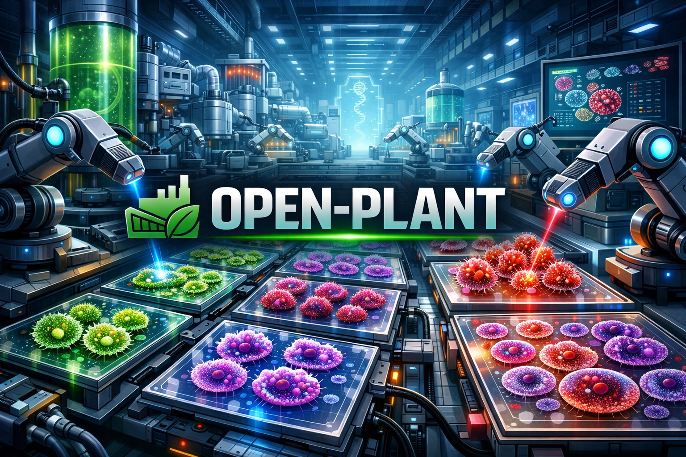

<p align="center">
  
</p>

<p align="center">
  WebGL2 기반 고성능 WSI(Whole Slide Image) 뷰어 라이브러리<br/>
  고사양 PC가 아니어도, 고작, 고~오작 iPhone 15에서 수백~수천만 cell을 부드럽게 렌더링
</p>

<p align="center">
  <a href="https://frorong.github.io/open-plant/">📖 Documentation</a>&nbsp;&nbsp;·&nbsp;&nbsp;
  <a href="https://frorong.github.io/open-plant/ko/migration-guide.html">Migration Guide</a>&nbsp;&nbsp;·&nbsp;&nbsp;
  <a href="https://frorong.github.io/open-plant/ko/contributing.html">Contributing</a>&nbsp;&nbsp;·&nbsp;&nbsp;
  <a href="https://github.com/frorong/open-plant">GitHub</a>
</p>

> Engine process note: [`engine-build-process.md`](./engine-build-process.md)

---

<h3 align="center">10,000,000 cells · ~300 MB RAM · 60 fps · iPhone 15 ready</h3>

https://github.com/user-attachments/assets/5a6b5deb-7442-4389-908f-bf2c69348824

> 핵심 포지셔닝: Open Plant는 데스크톱 전용 엔진이 아닙니다. iPhone 15급 모바일 환경에서도 수백만 cell pan/zoom 워크로드를 체감 렉 없이 다루는 것을 목표로 설계했습니다.

## Why Open Plant

범용 시각화 프레임워크 위에 병리 뷰어를 올리면 추상화 비용을 그대로 떠안게 됩니다.
Open Plant는 WSI 렌더링 **한 가지만** 하도록 설계되었고, 그래서 아래가 가능합니다.

### Open Plant vs deck.gl vs OpenLayers — 숫자로 증명하는 압도적 차이

같은 **합성 포인트 데이터**(랜덤 2D 좌표 + 16-class 팔레트)를 **3개 엔진의 각각 최적 경로**로 나란히 측정했습니다. (Apple M-시리즈, Chrome 실측)

- **deck.gl v9** — `ScatterplotLayer` binary accessor (`data.attributes`에 TypedArray 직전달, JS 객체 0개)
- **OpenLayers v10** — `WebGLVectorLayer` + `RenderFeature` (가장 가벼운 Feature 모델)
- 벤치마크 소스 & 재현: [`benchmark/`](./benchmark/)

#### 렌더 프레임 타임 (ms) — 실측

| 포인트 수 | Open Plant avg | deck.gl avg | 배율 | OpenLayers avg | 배율 |
|---|---|---|---|---|---|
| **500K** | **6.04 ms** | 69.81 ms | 11.6× | 17.06 ms | 2.8× |
| **1M** | **11.17 ms** | 139.72 ms | 12.5× | 18.43 ms | 1.7× |
| **2M** | **12.64 ms** | 265.96 ms | 21.0× | 32.04 ms | 2.5× |
| **5M** | **29.24 ms** | 639.59 ms | 21.9× | — | — |
| **10M** | **61.45 ms** | 1,203.25 ms | 19.6× | — | — |

> Open Plant는 모든 구간에서 deck.gl 대비 **12~22×** 빠릅니다. 2M까지 avg **12ms대**(~80fps), 5M에서 **29ms**(~34fps), 10M에서도 **61ms**(~16fps)를 유지합니다. deck.gl은 1M에서 이미 **140ms/frame** — 7fps도 안 나옵니다.
> OpenLayers는 2M까지는 측정 가능하지만 5M 이상에서는 Feature 빌드 단계에서 실패합니다.

#### First draw (초기화 + 첫 렌더)

| 포인트 수 | Open Plant | deck.gl | OpenLayers |
|---|---|---|---|
| **500K** | 48.1 ms | **4.3 ms** | 466.3 ms |
| **1M** | 22.6 ms | **20.9 ms** | 1,151.1 ms |
| **2M** | 26.8 ms | **15.6 ms** | 2,442.8 ms |
| **5M** | 44.5 ms | **16.7 ms** | — |
| **10M** | 90.0 ms | **21.5 ms** | — |

> deck.gl binary accessor는 first draw가 4~21ms로 가장 빠르지만, 이후 **프레임마다** 인스턴스 파이프라인 비용이 누적되어 sustained fps가 급락합니다.
> OpenLayers는 first draw에 RenderFeature 빌드 + WebGL 버퍼 구성이 포함되어, 2M에서 **2.4초**, 5M 이상은 실행 불가.

#### p99 프레임 타임 (worst-case jank)

| 포인트 수 | Open Plant p99 | deck.gl p99 | OpenLayers p99 |
|---|---|---|---|
| **500K** | **12.78 ms** | 119.40 ms | 41.70 ms |
| **1M** | **13.96 ms** | 287.30 ms | 48.00 ms |
| **2M** | **15.74 ms** | 322.20 ms | 109.40 ms |
| **5M** | **37.00 ms** | 1,384.30 ms | — |
| **10M** | **76.09 ms** | 2,495.20 ms | — |

#### 메모리 & 파이프라인

| 지표 | Open Plant | deck.gl (binary) | OpenLayers (RenderFeature) |
|---|---|---|---|
| **GPU 버퍼/점** | **10 B** (xy + palette idx) | 16 B (xyz + RGBA) | ~320 B (RenderFeature obj) |
| **Draw calls** | **1** (`gl.POINTS`) | N (인스턴스 배치 분할) | N |
| **JS 객체** | **0개** | **0개** | count개 RenderFeature |
| **빌드 비용 (2M)** | **0 ms** | ~16 ms | **152 ms** |
| **색상 변경** | 팔레트 텍스처 **64 B** 재업로드 | 전체 컬러 버퍼 재전송 | 스타일 재평가 + 버퍼 리빌드 |
| **hit-index** | **0 ms** main (Worker 오프로드) | 메인 스레드 피킹 빌드 | 메인 스레드 피킹 |

#### 왜 이렇게 차이가 나는가

| Open Plant 설계 | 범용 엔진이 버릴 수 없는 비용 |
|---|---|
| WSI 전용 직교 투영 → 투영 분기 없음 | 지리 좌표·투영·줌 레벨 범용 처리 |
| 팔레트 인덱스 1장 → 색상 버퍼 자체가 없음 | 피처별 RGBA + 스타일 콜백/파이프라인 |
| `gl.POINTS` 1-draw → 인스턴스 분할 없음 | 레이어 추상화 + 데이터 분할 |
| TypedArray 직통 GPU → JS 객체 0개 | Feature/RenderFeature 객체 모델 |
| hit-index/ROI 클립 전량 Worker | 메인 스레드 피킹 + 스타일 resolve |

deck.gl binary accessor(JS 객체 0개)를 써도 **1M 포인트에서 140ms/frame** — 7fps도 안 나옵니다.
OpenLayers는 가장 가벼운 `RenderFeature`를 써도 **5M 이상에서 실행 자체가 불가능**.
**Open Plant는 10M 포인트를 61ms/frame(~16fps)로 렌더** — deck.gl 대비 **19.6×** 빠릅니다.

> **직접 재현:** `cd benchmark && npm i && npx vite` → 브라우저에서 포인트 수 선택. Open Plant은 GPU timer query(또는 readPixels fence) 측정, deck.gl/OL은 rAF-to-rAF 측정.
> 내부 최적화 히스토리: [`perf-optimization-report.md`](./perf-optimization-report.md) · 운영 기본값: [`performance-optimization.md`](./performance-optimization.md)

### 모바일 실전 성능 (iPhone 15)

Open Plant는 “고사양 PC에서만 빠른 뷰어”가 아니라, iPhone 15 같은 일반 플래그십 모바일에서도
수백만 cell을 pan/zoom하면서 작업 가능한 성능을 목표로 최적화되어 있습니다.
타일 스케줄러 + fallback 렌더링 + TypedArray 포인트 파이프라인 덕분에, 실제 사용 시에도 뷰 전환 안정성을 유지합니다.
(`실효 성능은 데이터 밀도/타일 서버 응답/네트워크 상태에 따라 달라질 수 있습니다.`)

### 포인트 1개당 10바이트

범용 라이브러리는 포인트마다 인스턴스 버퍼에 position + RGBA를 넣어 **20바이트 이상** 씁니다.
Open Plant는 `Float32Array`(x, y) 8바이트 + `Uint16Array`(palette index) 2바이트 = **10바이트**입니다.
색상은 1×N 팔레트 텍스처 1장에 들어가므로, class 색상을 바꿀 때 수백 바이트짜리 텍스처만 재업로드하면 됩니다.
50만 셀 기준 GPU 메모리가 **절반 이하**로 줄어듭니다.

### 프래그먼트 셰이더 안에서 끝나는 링 렌더링

`gl.POINTS` + `gl_PointCoord`로 원형 마스킹하고, ring 두께는 `uPointStrokeScale * mix(0.18, 0.35, smoothstep(3.0, 16.0, uPointSize))`로 줌·스케일에 따라 적응합니다.
가장자리 안티앨리어싱은 `aa = 1.5 / max(1.0, uPointSize)`와 `smoothstep`으로 프래그먼트 셰이더 안에서 처리합니다.
고배율에서는 얇은 링으로 개별 세포를 구분하고, 저배율에서는 두꺼운 링으로 밀집 영역이 묻히지 않습니다.
별도 geometry 없이 draw call **1회**로 전체 포인트를 그립니다.

### 2-pass fallback 타일 렌더링

일반적인 타일 뷰어는 줌 전환 시 현재 tier 타일만 그리고, 로딩 중인 칸은 부모 타일을 확대하거나 회색 placeholder를 보여줍니다.
Open Plant는 매 프레임 **캐시 전체**(최대 320장)를 viewport와 교차 검사해서, tier 오름차순(가장 거친 것부터)으로 먼저 깔고 그 위에 현재 tier를 덮어씁니다.
줌/팬 중 **빈 타일이 보이지 않습니다.**

### 타일과 포인트가 같은 렌더 루프

별도 레이어 시스템 없이 하나의 WebGL2 컨텍스트에서 `fallback tiles → current tiles → points` 순서로 draw call이 나갑니다.
카메라가 바뀌면 한 프레임 안에 타일과 포인트가 **동시에** 갱신되므로 레이어 간 1-frame 지연이 없습니다.

### 드로잉 오버레이는 Canvas 2D로 분리

WebGL 캔버스(z-index: 1) 위에 Canvas 2D(z-index: 2)를 올려 어노테이션을 처리합니다.
draw mode가 아닐 때는 `pointerEvents: "none"`으로 이벤트가 WebGL에 바로 통과하고,
draw mode에 진입하면 `setPointerCapture`로 입력을 독점해 팬(드래그)은 차단합니다.
대신 wheel zoom은 오버레이에서 renderer로 전달해 draw/stamp 상태에서도 확대/축소를 유지합니다.

## Features

| | |
|---|---|
| **WebGL2 타일 렌더링** | 멀티 티어 타일 피라미드, LRU 캐시(320장), 저해상도 fallback 렌더링 |
| **타일 전용 색상 보정** | `imageColorSettings`로 brightness/contrast/saturation 실시간 반영 (cell/ROI/draw overlay는 영향 없음) |
| **회전 인터랙션** | `WsiViewState.rotationDeg`, `Ctrl/Cmd + drag` 회전, `resetRotation` 경로 |
| **줌 범위 제어 + 전환 애니메이션** | `minZoom`/`maxZoom` clamp + `viewTransition`(duration/easing) |
| **배율 스냅 줌** | `zoomSnaps`, `zoomSnapFitAsMin`으로 wheel/더블클릭을 표준 배율 단계에 맞춰 이동 |
| **포인트 오버레이** | WebGL2 `gl.POINTS` + 팔레트 텍스처. `WsiPointData`: `positions`/`paletteIndices` 필수, 선택 `fillModes`, `ids`, `drawIndices`(부분 draw) |
| **포인트 크기 커스터마이즈** | `pointSizeByZoom` 객체로 zoom별 셀(px) 크기 지정 + 내부 선형 보간 |
| **포인트 내부 채움 제어** | `pointInnerFillOpacity`로 ring 내부 채움 강도 제어 |
| **포인트 렌더 모드 제어** | `pointData.fillModes`로 ring/solid 렌더링 제어 |
| **Heatmap overlay** | `HeatmapLayer`로 hotspot density overlay 렌더링. `screen` / `fixed-zoom` 커널 모드, ROI clip, visibility toggle, typed point+weight 입력 |
| **모바일 타겟 성능** | iPhone 15급 환경에서 수백만 cell 워크로드를 전제로 pan/zoom 응답성을 유지하도록 설계 |
| **드로잉 / ROI 도구** | Freehand · Rectangle · Circular · Brush + Stamp(사각형/원, mm² 지정) |
| **고정 픽셀 스탬프** | `stamp-rectangle-4096px` + `stampOptions.rectanglePixelSize` |
| **브러시 UX 제어** | `brushOptions` (`radius`, `edgeDetail`, `edgeSmoothing`, `clickSelectRoi` 등) |
| **ROI 인터랙션 제어** | `activeRegionId` controlled/uncontrolled + contour/label 기반 hit-test |
| **ROI 라벨 동적 제어** | `resolveRegionLabelStyle` + `autoLiftRegionLabelAtMaxZoom` |
| **실시간 면적 툴팁** | `drawAreaTooltip`으로 draw 중 mm² 표시 |
| **ROI 포인트 클리핑** | `clipMode`: `sync` / `worker` / `hybrid-webgpu` (실험) |
| **ROI 통계 API** | `computeRoiPointGroups()` + `onRoiPointGroups` 콜백 |
| **ROI 커스텀 오버레이** | `resolveRegionStrokeStyle`, `overlayShapes` |
| **포인트 Hit-Test** | `PointLayer`의 `onHover`/`onClick`, `ref.queryAt(coord)`로 좌표→cell 매핑 |
| **WebGPU 연산 경로** | WebGPU capability 체크 + ROI bbox prefilter compute(실험) |
| **오버뷰 미니맵** | 썸네일 + 현재 뷰포트 인디케이터, 클릭/드래그 네비게이션 |
| **React 바인딩** | `<WsiViewer>` + 레이어(`PointLayer`, `RegionLayer`, `DrawingLayer` 등), `useViewerContext`, `<DrawLayer>`, `<OverviewMap>`, `<TileViewerCanvas>` |
| **좌표 변환** | `screenToWorld()` / `worldToScreen()` 양방향 좌표 변환 |
| **인증 지원** | Bearer 토큰 패스스루로 프라이빗 타일/포인트 엔드포인트 접근 |

## Quick Start

```bash
npm install
npm run dev:example
```

브라우저에서 `http://localhost:5174` 접속.

같은 LAN의 다른 기기에서 접속하려면 `example/vite.config.ts`에 `server.host: true`가 설정되어 있어야 하며(현재 예제 기본값), 방화벽에서 해당 포트를 허용합니다.

## 좌표계 (카메라)

- **World**: WSI 이미지 픽셀 좌표 (원점은 이미지 정의에 따름, 일반적으로 좌상단).
- **Screen**: 캔버스 내부 좌표 (`OrthoCamera`의 viewport = 캔버스 CSS 픽셀 × devicePixelRatio에 맞춘 내부 크기).
- **Clip (NDC)**: WebGL 클립 공간 −1~1. `OrthoCamera.getMatrix()`가 World → Clip 3×3 동차 변환을 반환하며, 타일/포인트 vertex 셰이더의 `uCamera`에 전달됩니다.
- **JS 변환**: `screenToWorld` / `worldToScreen`은 휠 줌 피벗, 히트 테스트 등 CPU 측 단일 점 변환에 사용됩니다.

## Project Structure

```
src/
├── core/
│   ├── gl-utils.ts              # 셰이더 컴파일·프로그램 링크
│   ├── ortho-camera.ts          # 2D 직교 카메라 (pan / zoom / rotation, World↔Screen, getMatrix)
│   ├── m1-tile-renderer.ts      # 단순 타일 그리드 데모용 렌더러
│   └── types.ts
├── wsi/
│   ├── wsi-tile-renderer.ts     # WebGL2 멀티티어 타일 + 포인트, 입력, 애니메이션
│   ├── wsi-render-pass.ts       # 프레임당 draw 순서: fallback 타일 → visible 타일 → 포인트
│   ├── wsi-shaders.ts           # 타일·포인트 GLSL 프로그램 초기화
│   ├── wsi-point-data.ts        # 포인트 VBO 업로드 (positions / classes / fillModes / drawIndices)
│   ├── wsi-interaction.ts       # 포인터·휠·스냅 줌 이벤트 처리
│   ├── wsi-input-handlers.ts    # interaction lock 등 래핑
│   ├── wsi-zoom-snap.ts         # 배율 스냅 애니메이션
│   ├── wsi-view-ops.ts          # zoomBy, fit, clamp 등 뷰 수학
│   ├── wsi-view-animation.ts    # 일반 뷰 보간 애니메이션
│   ├── wsi-tile-visibility.ts   # 뷰 바운드·타일 가시성
│   ├── wsi-tile-cache.ts        # 타일 텍스처 LRU 트림
│   ├── wsi-canvas-lifecycle.ts  # 컨텍스트 lost/restored
│   ├── tile-scheduler.ts        # 타일 fetch 큐, createImageBitmap, 재시도
│   ├── point-clip.ts            # 메인스레드 ROI 클리핑
│   ├── point-clip-worker-client.ts / point-clip-worker-protocol.ts
│   ├── point-clip-hybrid.ts     # WebGPU bbox prefilter (실험)
│   ├── point-hit-index-*.ts     # 포인트 공간 해시 인덱스 (워커)
│   ├── roi-geometry.ts / roi-class-stats.ts / brush-stroke.ts
│   ├── image-info.ts / types.ts / utils.ts / wkt.ts / webgpu.ts / constants.ts
│   └── …
├── workers/
│   ├── roi-clip-worker.ts
│   └── point-hit-index-worker.ts
└── react/
    ├── wsi-viewer.tsx           # WsiTileRenderer + ViewerContext (권장 엔트리)
    ├── viewer-context.ts        # rendererRef, worldToScreen, 오버레이 등록
    ├── heatmap-layer.tsx        # hotspot / density heatmap layer orchestration
    ├── heatmap-webgl.ts         # offscreen WebGL2 accumulation + colorize pass
    ├── point-layer.tsx          # 포인트 데이터·클리핑·히트 테스트
    ├── region-layer.tsx         # ROI Canvas2D
    ├── drawing-layer.tsx        # 드로잉 툴 진입 시 오버레이
    ├── draw-layer.tsx           # 실제 Canvas2D 드로잉 구현
    ├── patch-layer.tsx / overlay-layer.tsx
    ├── overview-map.tsx
    ├── tile-viewer-canvas.tsx   # 타일만 있는 경량 뷰어
    ├── use-point-clipping.ts / use-point-hit-test.ts / …
    └── wsi-viewer-canvas-types.ts  # 포인트/포인터 이벤트 타입
```

## React Components

**v1.4+** 공개 API는 `<WsiViewer>`와 **자식 레이어 컴포지션**입니다.  
과거 단일 컴포넌트 `WsiViewerCanvas`는 **이 저장소·npm 패키지에서 제거**되었습니다. props 매핑표는 [`docs/migration-1.4.0.md`](./docs/migration-1.4.0.md)와 [정적 문서](https://frorong.github.io/open-plant/)를 참고하세요.

### `<WsiViewer>`

`WsiTileRenderer` + WebGL 캔버스 + Canvas2D 오버레이 + `ViewerContextProvider`를 구성합니다. 타일·카메라·줌 스냅·포인터 world 스트림 등은 여기서 제어하고, 포인트/ROI/드로잉은 **자식 레이어**로 붙입니다.

| Prop | Type | Notes |
|---|---|---|
| `source` | `WsiImageSource \| null` | 필수 메타데이터 |
| `viewState` | `Partial<WsiViewState> \| null` | 외부 제어 |
| `onViewStateChange` | `(next: WsiViewState) => void` | 뷰 변경 통지 |
| `imageColorSettings` | `WsiImageColorSettings \| null` | 타일에만 적용 (BC/S) |
| `fitNonce` | `number` | 증가 시 fit 재실행 |
| `rotationResetNonce` | `number` | 증가 시 회전 0° |
| `authToken` | `string` | 타일 fetch Bearer 등 |
| `ctrlDragRotate` | `boolean` | 기본 `true` |
| `minZoom` / `maxZoom` | `number` | 미지정 시 `fitZoom*0.5` / `fitZoom*8` |
| `viewTransition` | `WsiViewTransitionOptions` | `setViewState`/`fitToImage` 등 전환 |
| `zoomSnaps` | `number[]` | 배율 배열 → `mpp` 기준 내부 zoom으로 정규화 |
| `zoomSnapFitAsMin` | `boolean` | 스냅 아웃 시 fit을 하한으로 |
| `onStats` | `(WsiRenderStats) => void` | 프레임 통계 |
| `onTileError` | `(WsiTileErrorEvent) => void` | 타일 로드 실패 |
| `onContextLost` / `onContextRestored` | `() => void` | WebGL 컨텍스트 |
| `onPointerWorldMove` | `(PointerWorldMoveEvent) => void` | 포인터 world 좌표 |
| `debugOverlay` | `boolean` | 간단한 디버그 패널 |
| `className` / `style` | — | 루트 컨테이너 |
| `children` | `ReactNode` | 아래 레이어 컴포넌트 |

```tsx
import {
  DrawingLayer,
  HeatmapLayer,
  OverviewMap,
  OverlayLayer,
  PatchLayer,
  PointLayer,
  RegionLayer,
  useViewerContext,
  WsiViewer,
} from "open-plant";

<WsiViewer source={source} viewState={vs} onViewStateChange={setVs} authToken={token} zoomSnaps={[...]} zoomSnapFitAsMin>
  <PointLayer data={pointData} palette={palette} sizeByZoom={sizes} clipEnabled clipToRegions={rois} clipMode="worker" />
  <HeatmapLayer
    data={heatmapData}
    visible
    opacity={0.82}
    radius={4}
    blur={2}
    scaleMode="fixed-zoom"
    fixedZoom={source.maxTierZoom + Math.log2(Math.max(1e-6, vs.zoom))}
    clipToRegions={rois}
  />
  <RegionLayer regions={rois} ... />
  <DrawingLayer tool={drawTool} ... />
  <PatchLayer regions={patches} ... />
  <OverlayLayer shapes={overlayShapes} />
</WsiViewer>
```

미니맵은 보통 `WsiViewer` **밖**에서 `useViewerContext()`로 `rendererRef`를 넘기거나, 예제처럼 래퍼 컴포넌트로 `<OverviewMap projectorRef={rendererRef} invalidateRef={overviewInvalidateRef} ... />`를 둡니다 (`example/src/App.tsx` 참고).

### 레이어 컴포넌트 (요약)

| 컴포넌트 | 역할 |
|---|---|
| **PointLayer** | `WsiPointData` + 팔레트, zoom별 크기, ROI 클리핑(`clipMode`: `sync` / `worker` / `hybrid-webgpu`). `ref` → `queryAt(coord)` imperative hit |
| **HeatmapLayer** | `HeatmapPointData` 기반 hotspot/density 오버레이. `screen` / `fixed-zoom` 커널, optional `weights`, ROI clip, `onStats` |
| **RegionLayer** | ROI contour/라벨 Canvas2D, hover/active, hit-test |
| **DrawingLayer** | 드로잉 모드 진입·휠 줌 전달 등; 내부에서 **DrawLayer** 사용 |
| **DrawLayer** | 실제 freehand/rect/circle/brush/stamp 구현 |
| **PatchLayer** | 패치 ROI 전용 스트로크 |
| **OverlayLayer** | `DrawOverlayShape` 반전 채움 등 |

### `useViewerContext()`

`rendererRef`, `rendererSerial`, `source`, `worldToScreen`, `registerDrawCallback`, `overviewInvalidateRef`, interaction lock 등 — 커스텀 오버레이·미니맵에서 사용합니다.

### `<HeatmapLayer>`

현재 구현은 offscreen WebGL2 누적/컬러라이즈 후 공유 오버레이 캔버스에 합성하는 레이어입니다. `screen` 모드는 현재 화면 기준으로 level/정규화/커널을 선택하고, `fixed-zoom` 모드는 **continuous zoom** 기준(`source.maxTierZoom + log2(viewState.zoom)`)으로 잠근 시점의 heatmap state를 유지합니다. WebGL2 초기화에 실패하면 레이어는 warning을 남기고 렌더를 건너뜁니다.

| Prop | Type | Notes |
|---|---|---|
| `data` | `HeatmapPointData \| null` | `count`, `positions`, optional `weights` |
| `visible` | `boolean` | 독립 토글 |
| `opacity` | `number` | `0..1` |
| `radius` / `blur` | `number` | 커널 크기 (CSS px) |
| `gradient` | `readonly string[]` | 색상 stop 배열 |
| `backgroundColor` | `string \| null` | 기본 `null` |
| `scaleMode` | `"screen" \| "fixed-zoom"` | 최소 지원 모드 |
| `fixedZoom` | `number` | `scaleMode="fixed-zoom"`일 때의 continuous zoom 기준값 |
| `zoomThreshold` | `number` | heatmap이 반응하는 유효 줌을 뒤로 미루는 continuous zoom offset. 양수일수록 더 높은 실제 줌까지 heatmap이 크게 유지됨 |
| `densityContrast` | `number` | sparse 영역은 더 눌러두고 dense 영역은 더 빨리 강조하는 대비 계수 |
| `clipToRegions` | `WsiRegion[]` | ROI 내부로 mask + point filter |
| `maxRenderedPoints` | `number` | visible bin budget. 기본 `48000` |
| `zIndex` | `number` | 오버레이 draw priority |
| `onStats` | `(stats) => void` | point count / render time 등 |

### `<DrawLayer>` (단독 사용)

`WsiViewer` 없이도 마운트 가능합니다. 툴: `freehand`, `rectangle`, `circular`, `brush`, `stamp-*`. 브러시는 화면 px 반경 + `edgeDetail` / `edgeSmoothing`. `Esc`로 세션 취소.

### `<OverviewMap>`

뷰포트 인디케이터 + (옵션) 썸네일 타일. `WsiViewer`에 prop으로 붙지 않고 **`projectorRef`에 `WsiTileRenderer` ref**를 넘겨 동기화합니다.

| Option | Type | Notes |
|---|---|---|
| `width` / `height` | `number` | 미니맵 캔버스 크기 |
| `margin`, `position`, `borderRadius` | — | 배치 |
| `backgroundColor`, `borderColor` | `string` | 배경/테두리 |
| `viewportBorderStyle` | `"stroke" \| "dash"` | 뷰포트 테두리 |
| `viewportBorderColor`, `viewportFillColor` | `string` | 뷰포트 선/채움 |
| `interactive` | `boolean` | 클릭/드래그로 이동 |
| `showThumbnail`, `maxThumbnailTiles` | — | 썸네일 |
| `onClose`, `closeIcon`, `closeButtonStyle` | — | 닫기 UI |

### `<TileViewerCanvas>`

타일만 필요한 경량 뷰어 (포인트/ROI 없음).

### 동작 규약 (공통)

- `mpp`는 스탬프 mm² 환산 등에 사용; 없으면 물리 크기는 근사치입니다.
- `imageColorSettings`는 **타일**에만 적용됩니다. 포인트/ROI/드로잉은 별도입니다.
- ROI hit-test는 **contour + nametag** 기준입니다 (내부 fill 제외).
- `minZoom`/`maxZoom`은 휠·더블클릭·`setViewState`·`fitToImage` 전 경로에 동일하게 clamp됩니다.
- `zoomSnaps` 입력은 **배율**이며 `source.mpp`로 내부 zoom으로 변환됩니다.
- `brushOptions.radius`는 CSS px, 줌과 무관하게 화면에서 고정 크기입니다.
- `roiRegions[].coordinates`는 ring / polygon(holes) / multipolygon을 지원합니다.

## API

`src/index.ts` 기준 공개 export 요약입니다.

| Export | 설명 |
|---|---|
| `WsiViewer`, `PointLayer`, `HeatmapLayer`, `RegionLayer`, `DrawingLayer`, `DrawLayer`, `PatchLayer`, `OverlayLayer`, `OverviewMap`, `TileViewerCanvas` | React |
| `useViewerContext` | 컨텍스트 (`rendererRef`, `worldToScreen`, …) |
| `WsiTileRenderer`, `M1TileRenderer`, `TileScheduler` | 코어 렌더러·타일 큐 |
| `normalizeImageInfo`, `toTileUrl`, `toRoiGeometry`, `parseWkt` | 이미지/ROI/WKT |
| `buildClassPalette`, `calcScaleResolution`, `calcScaleLength`, `toBearerToken`, `clamp`, `hexToRgba`, `isSameViewState` | 유틸 |
| `filterPointDataByPolygons`, `filterPointIndicesByPolygons`, `filterPointDataByPolygonsInWorker`, `filterPointIndicesByPolygonsInWorker`, `terminateRoiClipWorker`, `filterPointDataByPolygonsHybrid` | ROI 클리핑 |
| `buildPointSpatialIndexAsync`, `lookupCellIndex`, `terminatePointHitIndexWorker` | 포인트 공간 인덱스(워커) |
| `computeRoiPointGroups` | ROI class 통계 |
| `getWebGpuCapabilities`, `prefilterPointsByBoundsWebGpu` | WebGPU(실험) |
| `closeRing`, `createRectangle`, `createCircle` | 도형 |
| 타입 (`WsiViewerProps`, `WsiImageSource`, `WsiPointData`, `WsiViewState`, `DrawTool`, `PointHitEvent`, …) | TS |

레거시 `WsiViewerCanvas` / `WsiViewerCanvasProps`는 패키지에 **포함되지 않습니다**.

## Scripts

```bash
npm run dev            # 개발 서버 (기본 타일 그리드)
npm run dev:example    # 예제 앱 (전체 WSI 뷰어, port 5174)
npm run build          # 프로덕션 빌드
npm run build:example  # 예제 앱 빌드
npm run typecheck      # 타입 체크
npm run test:ws9       # unit + perf + e2e(smoke)
npm run release:gate   # typecheck + test:ws9 + build:lib
```

## Contributing

See `CONTRIBUTING.md` and docs:

- EN: `docs/en/contributing.html`
- KO: `docs/ko/contributing.html`

## License

MIT
